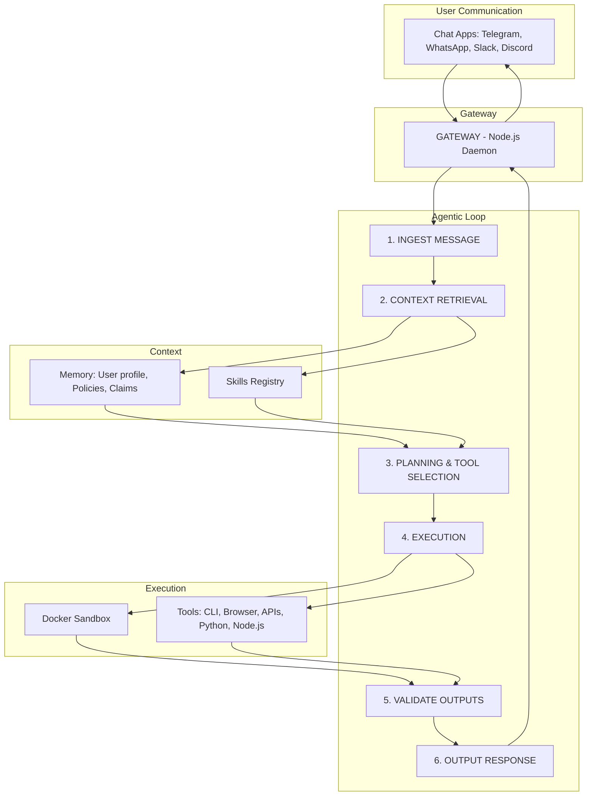

# InsurClaw — Agentic Flow
### Gateway → Message Ingest → Context Retrieval → Planning & Tool Selection → Execution → Response

---

## Flow Diagram

---

## Step Definitions

### 1. INGEST MESSAGE

**Input:** User message or external event (cron trigger, webhook, API call)

**Actions:**
- Parse intent from message content
- Authenticate user and resolve session
- Classify domain: Prevention | Event | Underwriting | Claims
- Route to orchestrator (Consumer Advocate)

**Output:** Structured intent + session context for downstream steps

---

### 2. CONTEXT RETRIEVAL

**Input:** Session ID, classified intent

**Sources (Local File System / Memory):**
- User risk profile (SQLite + vector embeddings)
- Active policies and coverage map
- Claims history
- GDPR consent state and jurisdiction
- Skills registry (YAML configs)
- Relevant agent_performance.json weights

**Actions:**
- Load user context from memory layer
- Load only skills relevant to intent (dynamic loading)
- Retrieve EU compliance state
- Fetch approval gate status

**Output:** Assembled context for planning step

---

### 3. PLANNING & TOOL SELECTION

**Input:** Intent, assembled context

**Actions:**
- Select specialist agents (Prevention, Event, Underwriting, Claims)
- Select tools required for task
- Run safety check: Tier 1 / 2 / 3 action classification
- Determine approval gates if external action required

**Output:** Execution plan with agent delegation, tool list, safety checks

---

### 4. EXECUTION

**Input:** Execution plan

**Actions:**
- Run agents in isolated Docker workspaces
- Invoke tools (CLI, browser, APIs, Python, Node.js)
- Multi-agent coordination if domain requires (voting mechanism)
- External API calls where authorized

**Output:** Raw agent outputs, tool results

---

### 5. VALIDATE OUTPUTS

**Input:** Raw outputs from execution

**Actions:**
- Check against EU compliance (GDPR, IDD, EU AI Act)
- Verify approval gates for any gated action
- Check confidence thresholds
- Conflict of interest scan
- Humanize output (strip AI patterns)

**Output:** Validated, human-ready response

---

### 6. OUTPUT RESPONSE

**Input:** Validated response

**Actions:**
- Deliver to originating channel (Telegram, WhatsApp, etc.)
- Log to audit trail
- Request approval if gated action required
- Register event in main_log and agentic_log

**Output:** User receives response; system state updated

---

## Relation to Cron Jobs and JTBD

#Claw executes programmable computation commands for each `<cron>` Job To Be Done as triggered or fetched from other #AGENT#.

**Cron-triggered flow:**
1. Cron job fires (e.g., weather monitoring every 15 min)
2. Gateway receives internal trigger
3. Agentic loop runs with "scheduled task" as intent
4. Specialist agent executes (e.g., Prevention Agent)
5. Result logged to main_log; if alert needed, response sent to user

**Agent-to-agent flow:**
- One agent may delegate to another via `session.delegate(agent_id, task, context)`
- Invoked agents and triggered cron jobs have agentic workflow with `<agentic_log>` as registry output
- Each executed command and JTBD trigger is registered in `<main_log>` for event registry
- Specialized agents also have their own `<agent-NAME_log>`

---

## Context Sources Summary

| Source | Location | Content |
|--------|----------|---------|
| User risk profile | SQLite + vector | Risk scores, behavioral data, history |
| Active policies | /workspace/sessions/{id}/active_policies/ | Policy documents, coverage map |
| Claims history | /workspace/sessions/{id}/claim_history/ | Open and closed claims |
| GDPR consent | /workspace/sessions/{id}/compliance_state/gdpr_consent.json | Consent state |
| Skills registry | skills/*.yaml, skills/*/SKILL.md | Skill definitions |
| Agent performance | agent_performance.json | Confidence weights for voting |

---

*InsurClaw Agentic Flow v1.0 | EU Market | Mar 2026*
