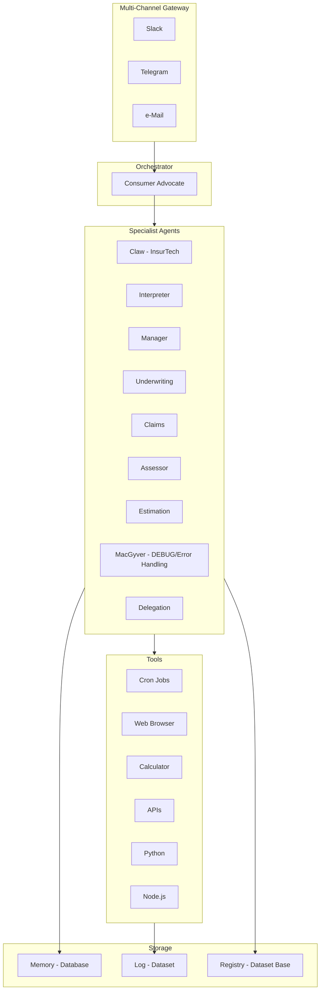

# InsurClaw — Components
### Agents, Gateway, Tools, Memory, Log, Registry

---

## Component Hierarchy

---

## Agents

| Component | Role | Description |
|-----------|------|-------------|
| **Claw** | InsurTech core | Domain-specific insurance logic, EC 261/2004, parametric triggers |
| **Interpreter** | Command parsing | Parse user/cron commands, route to appropriate agent |
| **Manager** | Session/orchestration | Session management, context assembly, approval gate coordination |
| **Underwriting** | Risk engine | Risk assessment, product comparison, policy issuing support |
| **Claims** | Claim handling | Loss adjuster, appraisal, assessor, claim cost & evaluation |
| **Assessor** | Coverage assessment | Coverage applicability, exclusion challenges |
| **Estimation** | Cost estimation | Settlement range prediction, reserve analysis |
| **MacGyver** | DEBUG / error handling | Error recovery, fallback logic, edge case handling |
| **Delegation** | Agent routing | Delegate tasks to specialist agents, coordinate multi-agent workflows |

---

## Multi-Channel Gateway

| Channel | Status | Purpose |
|---------|--------|---------|
| **Slack** | Supported | Team/enterprise communication |
| **Telegram** | Primary | Consumer channel, quick actions |
| **e-Mail** | Supported | Formal communication, approval drafts |

**Gateway responsibilities:**
- Parse inbound messages
- Authenticate users
- Route to orchestrator (Consumer Advocate)
- Deliver outbound responses
- Audit log all inbound/outbound

---

## Tools

| Component | Purpose |
|-----------|---------|
| **Cron jobs** | Scheduled tasks (weather, flight poll, renewal checks, claims status) |
| **InsurTech Claw** | Insurance-specific workflows |
| **Web browser** | Headless Chrome for carrier portals, aggregators |
| **Calculator** | Compensation, premium, settlement calculations |
| **APIs** | ADS-B, EUMETNET, carrier APIs, aggregators |
| **Python** | Data processing, OCR, ML inference |
| **Node.js** | Gateway runtime, async I/O |

---

## Memory

**Type:** Database (SQLite + pgvector for production)

**Contents:**
- User risk profiles
- Active policies
- Claims history
- GDPR consent state
- Vector embeddings for semantic search

**Location:** `/workspace/sessions/{id}/` + SQLite tables

---

## Log

**Type:** Dataset (file-based + audit_log table)

**Contents:**
- Event registry (main_log)
- Agentic workflow log (agentic_log)
- Per-agent logs (agent-NAME_log)

**Purpose:** Audit trail, compliance, debugging, performance analysis

---

## Registry

**Type:** Dataset base

**Contents:**
- Skills registry (YAML configs, SKILL.md files)
- Agent performance (agent_performance.json)
- Compliance state (jurisdiction, consent)
- Approval gate status

**Purpose:** Configuration, dynamic skill loading, coordination weights

---

## Component Interaction Summary

1. **Gateway** receives message from Slack/Telegram/Email
2. **Interpreter** parses intent, **Manager** assembles context
3. **Consumer Advocate** (orchestrator) classifies domain, **Delegation** routes to specialist
4. **Specialist agents** (Underwriting, Claims, etc.) execute using **Tools**
5. **MacGyver** handles errors and edge cases
6. **Memory** stores/retrieves user data; **Log** records events; **Registry** provides config
7. **Gateway** delivers response to user

---

*InsurClaw Components v1.0 | EU Market | Mar 2026*
